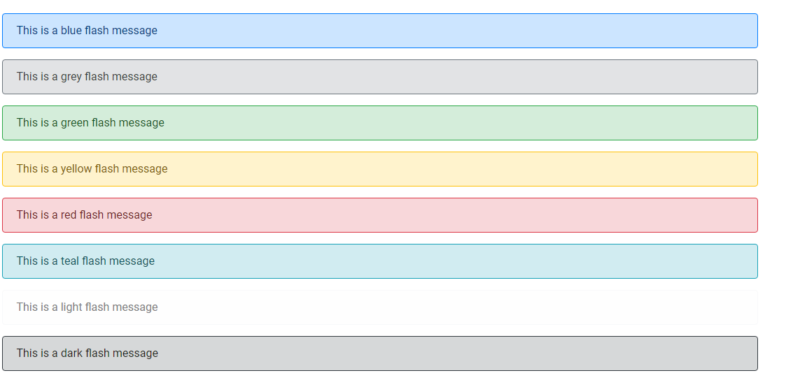

# EasyFlashMessage

EasyFlashMessage is a micro-library for easily creating and rendering [Bootstrap](https://getbootstrap.com/) 4-based
flash messages for PHP. EasyFlashMessage can be used with [Slim 3](http://www.slimframework.com/) and [Twig 2](https://twig.symfony.com/) template engine to create globally-available flash messages that can be rendered in any view, or can be tweaked to work with another framework, or without any framework at all.


## Getting Started

### Prerequisites
EasyFlashMessage has been written to work with Slim v3 but could be tweaked to
work with Slim 4. If you are using EasyFlashMessage with Slim and Twig, install
Slim with composer:

```
composer require slim/slim:^3.1
```
Then install the slim/twig-view component:

```
composer require slim/twig-view
```


**Step 1.** Download and add the EasyFlashMessage library to your src folder. Next
update your `composer.json` file to include the EasyFlashMessage classes in the
autoloader:

```
"autoload": {
    "psr-4": {
        "EasyFlashMessage//": "path/to/src/EasyFlashMessage/EasyFlashMessage/src"
    }
}
```
If the classes still do not autoload, check the file path and run

```
composer dump-autoload
```
**Step 2** If you are using EasyFlashMessage with Slim and Twig, register Twig as a service
on Slim's dependency injection container:

```php
<?php


use Slim\App;


$container = $app->getContainer();

$container['view'] = function($c) {
    $view = new \Slim\Views\Twig('path/to/templates', ['cache' => false]);

    // Instantiate and add Slim specific extension
    $router = $c->get('router');
    $uri = \Slim\Http\Uri::createFromEnvironment(new \Slim\Http\Environment($_SERVER));
    $view->addExtension(new \Slim\Views\TwigExtension($router, $uri));
    return $view;
};
```

**Step 3.** If you want globally-available flash messages, register the
`EasyFlashMessageMiddleware` component for all routes:

```php
<?php


use Slim\App;


$app->add(new \EasyFlashMessage\Middleware\EasyFlashMessageMiddleware($container));

```

**Step 4.** Instantiate the `EasyFlashMessage` component in your controller:

```php
<?php


use EasyFlashMessage\EasyFlashMessage\EasyFlashMessage as Flash;


// A simplified controller class to illustrate a basic use-case

class ExampleController
{

    public function renderExampleLoginPage($request, $response, $args)
    {
        if ($auth->login($user, $password)) {
            $flash = new Flash('success', 'Thanks for logging in! Nice to see you again!');
            return $response->withRedirect('/home');
        }
    }
}
```

**Step 6:** Render the flash message in a Twig template using `{{ flash|raw }}`:

```php




{{ flash|raw }}


```

Alternatively, if you are using EasyFlashMessage without a framework or do not need
globally-available flash messages, you can render the flash message from the
`EasyFlashMessage` component's public `markup` property:

```php
<?php
use EasyFlashMessage\EasyFlashMessage\EasyFlashMessage as Flash;
?>


<div>
    <?php
    $flash = new Flash('success', 'Thanks for logging in! Nice to see you again!');
    echo $flash->markup;
    ?>
</div>
```

Result:


If you are using the `EasyFlashMessageMiddleware` component the flash message will
remain until the next page reload. If you only want it to
last a few seconds, [jQuery](https://jquery.com/)'s `hide()`
or `slideUp()` methods should provide a good
solution.

## Flash Message Colours



## Contributing

If you decide to use EasyFlashMessage and find a way to improve it in a way that
would be beneficial across projects then please feel very free to make a pull request!

## Authors

* **Michael Cook**

## License

This project is licensed under the MIT License. See [LICENSE.md](LICENSE.md)

## Acknowledgements

* **Mark Railton** - https://github.com/railto
Mark's simple PHP flash message component was the inspiration for this project, as
I sought to take what he had created and simplify it and make it work easily with Twig.
[See Mark's Personal Site](https://www.markrailton.com)
